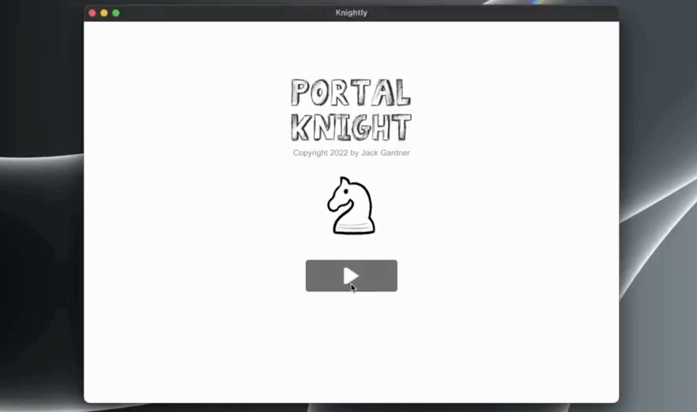
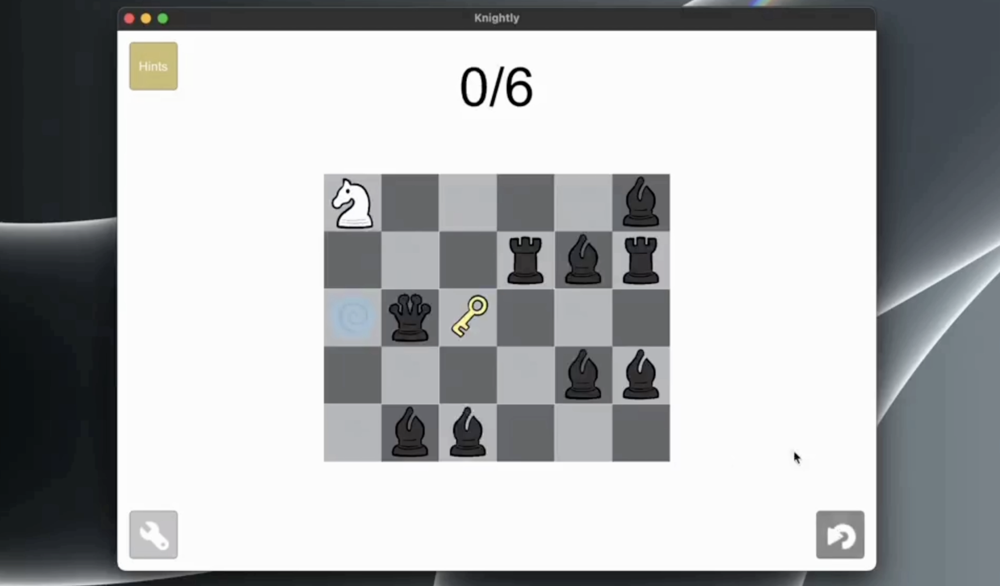
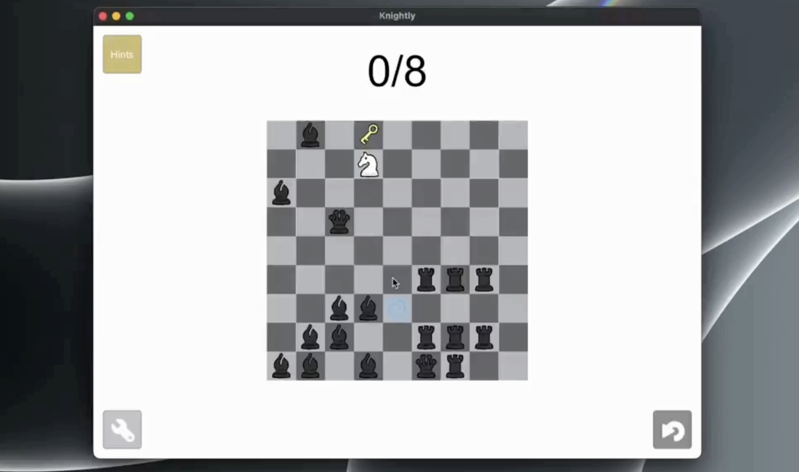

### Portal Knight

A link to gameplay footage: https://www.linkedin.com/feed/update/urn:li:activity:7125704209798189056/

Portal Knight is a casual puzzle game focused on enhancing the player’s ability to maneuver the knight, one of the most challenging chess pieces. Players control a knight piece on a chessboard and must escape from enemy pieces using the knight's unique L-shaped movement pattern. Each level is procedurally generated, and enemies are dynamically placed along the player’s path, offering a fresh challenge every time.

[]

## Features
# 🎲 Random Level Generation

Levels are procedurally generated using a random pathfinding algorithm, creating unique challenges with each playthrough.

# 📏 Customizable Board Size

Players can adjust the size of the chessboard to match their preferred difficulty level.

[]

# 👾 Enemy Placement

Enemies are intelligently placed around the player’s path, ensuring that every level provides a different experience.

[]

# 💡 Hints System

Players can activate hints to visualize safe zones or escape routes.

# ♟️ Chess-Inspired Gameplay

Use the knight’s L-shaped movement pattern to avoid enemies and reach the goal.

## Technologies/Techniques Used

Unity: Developed using Unity with C#.
Component-Based Architecture: The project is built with a modular component-based architecture for flexibility and maintainability.
